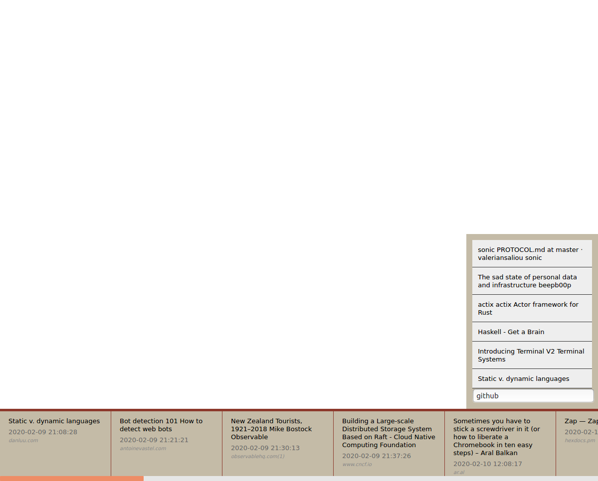
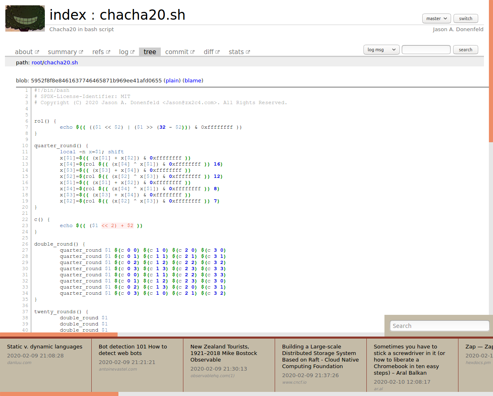

# Web Archive Viewer

This is a small application to browse archived webpages stored in the [MAFF](https://en.wikipedia.org/wiki/Mozilla_Archive_Format) format.

Archives are created using the WebScrapBook extension for [Firefox](https://addons.mozilla.org/en-US/firefox/addon/webscrapbook/) or [Chrome](https://chrome.google.com/webstore/detail/webscrapbook/oegnpmiddfljlloiklpkeelagaeejfai). An example config file is included in this repo, which can be imported into the extension.

The MAFF file is technically just a zip file, this app uses the native [zip](http://erlang.org/doc/man/zip.html) library in Erlang to scan and serve the files.

This means the files are never "unzipped", and served directly from the zip file itself. This saves disk space and time.

All MAFF files are opened on startup, but not decompressed, and remain open during the lifetime of the application.

Every minute, the app scans the directory to look for new archives to ingest.

The app utilizes [Meeseeks](https://github.com/mischov/meeseeks) and [Sonic](https://github.com/valeriansaliou/sonic) for HTML parsing and search capability, respectively.

Sonic is a lightweight alternative to something like Elasticsearch, and is blazing fast.

## Running Locally

There is a `docker-compose.yml` file included to get up and running locally quickly.

### Steps

```bash
$ cp default.env dev.env
```

```bash
$ cat dev.env
export ARCHIVE_PATH="/path/to/your/web_archive/data"
export DOCKER_ARCHIVE_PATH="/data"
export SEARCH_HOST="localhost"
export SEARCH_PORT="1491"
```

Update the `ARCHIVE_PATH` in `dev.env` to point to the root directory of your archives. This should end in `/data`

The included config file for WebScrapBook writes the files like so.

```bash
$ tree ./data
./data
└── 2020
    └── 02
        ├── 09
        │   ├── Bot detection 101_ How to detect web bots_ _ antoinevastel.com.maff
        │   ├── Building a Large-scale Distributed Storage System Based on Raft - Cloud Native Computing Foundation _ www.cncf.io.maff
        │   ├── New Zealand Tourists, 1921–2018 _ Mike Bostock _ Observable _ observablehq.com(1).maff
        │   └── Static v. dynamic languages _ danluu.com.maff
        ├── 10
        │   ├── Sometimes you have to stick a screwdriver in it (or how to liberate a Chromebook in ten easy steps) – Aral Balkan _ ar.al.maff
        │   └── Zap — Zap v0.2.0 _ hexdocs.pm.maff
        ├── 11
        │   └── Best Jazz Albums 2019 — JazzTrail _ NY Jazz Scene _ Album Reviews _ Jazz Photography _ jazztrail.net.maff
        ├── 12
        │   ├── Gears – Bartosz Ciechanowski _ ciechanow.ski.maff
        │   └── Why are we so bad at software engineering_ _ www.bitlog.com _ www.bitlog.com.maff
        └── 13
            ├── actix_actix_ Actor framework for Rust _ github.com.maff
            ├── beautiful _ www.cs.princeton.edu.maff
            ├── Building data liberation infrastructure _ beepb00p _ beepb00p.xyz.maff
            ├── chacha20.sh - chacha20.sh - Chacha20 in bash script _ git.zx2c4.com.maff
            ├── Haskell - Get a Brain _ www-cs-students.stanford.edu.maff
            ├── Illustrations – Old Book Illustrations _ www.oldbookillustrations.com.maff
            ├── Introducing Terminal V2 _ Terminal Systems _ blog.terminal.co.maff
            ├── sonic_PROTOCOL.md at master · valeriansaliou_sonic _ github.com.maff
            ├── The Missing Guide to Racket's Web Server - defn.io _ defn.io.maff
            └── The sad state of personal data and infrastructure _ beepb00p _ beepb00p.xyz.maff
```

Next source your env file

```bash
source dev.env
```

Finally run

```bash
docker-compose up --build
```

Once everything is built and running, browse to [http://localhost:4000](http://localhost:4000) and enjoy a totally offline internet ;)

## Development Notes

There is a .tool-versions file included with the repo for usage with [asdf](https://github.com/asdf-vm/asdf). You can just run `asdf install` in the local directory and it will install all the system packages need for development and running the app locally.

## Personal Notes

I have several computers I use regularly, I have Resilio aka BitTorrent Sync setup on each computer, as well as a NAS. I've added my archive directory to my NAS instance and mounted it on each of my laptops. This way I can save a webpage from any desktop, have it synced to the NAS and viewable within a minute in my local Web Archive Viewer application.

# Screenshots







